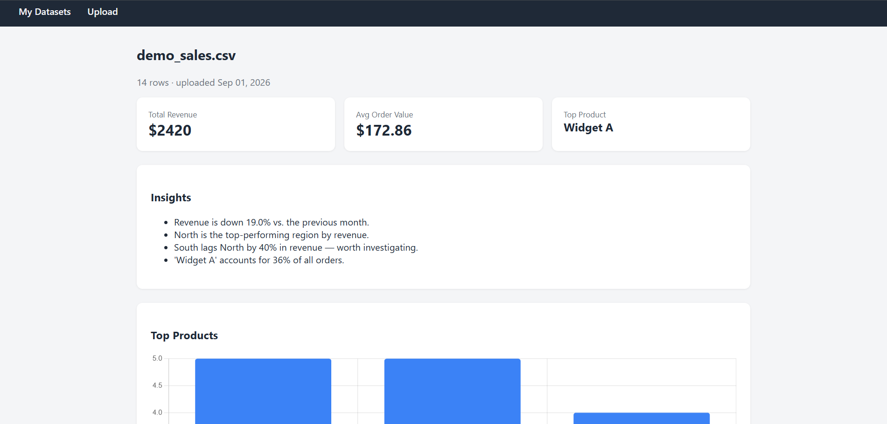

# Business Analytics Dashboard

A Django + pandas web app that turns messy sales data into a cleaned,
interactive dashboard with auto-generated insights — upload a CSV or
Excel file and get KPIs, charts, and a plain-English summary in seconds.

**Live demo:** https://analytics-dashboard-1-c944.onrender.com
(try the pre-loaded sample dataset, or upload your own CSV — note: the
free-tier instance spins down after inactivity, so the first load may
take 30-60 seconds)



## Why I built this

I wanted a project that combined my Python/Django background with the
data analysis side of my certificates (pandas, Excel) — something
closer to a real business tool than a typical CRUD tutorial project.

## Features

- CSV/Excel upload with automatic data cleaning (missing values, duplicates,
  type coercion) — every cleaning action is logged and shown to the user
- Interactive dashboard: KPIs, Chart.js visualizations
- Rule-based auto-insights (revenue trends, regional comparisons, outliers,
  top product share)
- Export a summary as PDF or a multi-sheet Excel workbook
- Per-user accounts — your uploads are private

## Tech Stack

- **Backend:** Django, PostgreSQL
- **Data processing:** pandas, numpy
- **Charts:** Chart.js
- **Export:** WeasyPrint (PDF), openpyxl (Excel)
- **Deployment:** Docker, Render

## Design Decisions

- **JSON field vs normalized table for cleaned data:** chose a JSONField
  on the `Dataset` model for simplicity — the whole dataset is reloaded
  into a pandas DataFrame per request anyway, so a normalized `DataRow`
  table would add write complexity without a clear read benefit at this scale.
- **Rule-based insights over ML:** kept insight generation to clear,
  explainable pandas comparisons (month-over-month change, regional gaps,
  outlier detection) rather than a black-box model — more trustworthy for
  a business user and much easier to reason about and test.
- **WeasyPrint for PDF, moved to Docker:** I originally deployed on Render's
  Python buildpack, but WeasyPrint needs system-level libraries (Pango,
  Cairo) that the buildpack doesn't expose control over. Moving to a
  Dockerfile let me install those dependencies explicitly and get identical
  behavior locally and in production.
- **Migrations run on container startup:** the free Render tier doesn't
  include Shell access, so `start.sh` runs `migrate` automatically before
  starting gunicorn on every deploy, instead of requiring a manual step.

## Running Locally

```bash
git clone git clone https://github.com/J11Abhishek/analytics-dashboard.gits
cd analytics-dashboard
cp .env.example .env   # fill in your own values
docker-compose up --build
docker-compose exec web python manage.py migrate
docker-compose exec web python manage.py createsuperuser
```

Visit `http://localhost:8000`.

## What I'd Improve With More Time

- Background processing (Celery + Redis) for very large file uploads
- A normalized data table + proper query-based filtering instead of
  reloading the full DataFrame per request
- More insight types, possibly a lightweight anomaly-detection model
- Custom 404/500 error pages for a fully polished production feel
